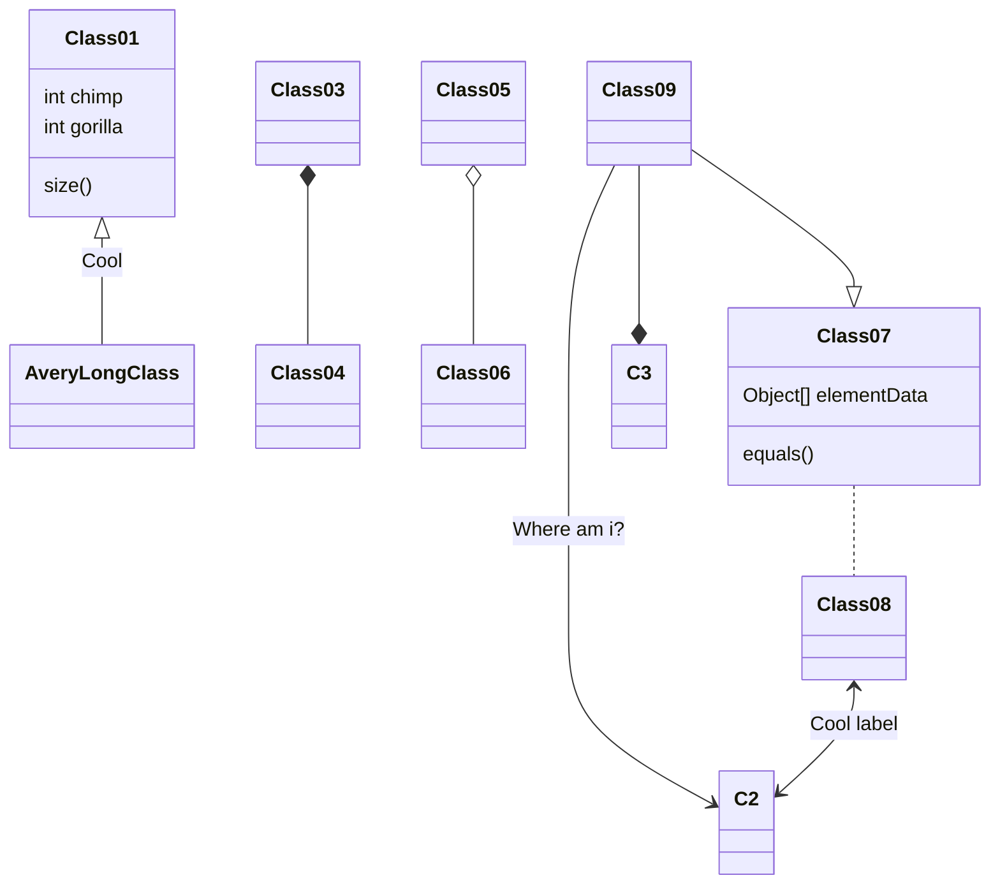

---

title: 测试
math: true
date: 2019-10-10 10:00:00
comment: 'waline'
mermaid: true
index_img: /img/index.jpg
---

<b style='color:#ff6b81'><font size = 4>tuple结构</font></b>

<details>
<summary>点击查看代码</summary>


```
<b style='color:#ff6b81'><font size = 4>tuple结构</font></b>
```

</details>

<div style="border-radius: 15px; background-color: rgba(30, 144, 255, 0.1); padding: 8px; border: 1px solid rgba(135, 206, 250, 1); box-sizing: border-box; overflow: hidden; margin-bottom: 10px">
蓝色框框
</div>


<details>
<summary>点击查看代码</summary>


```
<div style="border-radius: 15px; background-color: rgba(30, 144, 255, 0.1); padding: 8px; border: 1px solid rgba(135, 206, 250, 1); box-sizing: border-box; overflow: hidden; margin-bottom: 10px">
蓝色框框
</div>
```

</details>

<div style="border-radius: 15px; background-color: rgba(0, 128, 128, 0.1); padding: 8px; border: 1px solid rgba(0, 250, 154, 1); box-sizing: border-box; overflow: hidden; margin-bottom: 10px">
绿色框框
</div>


<details>
<summary>点击查看代码</summary>


```
<div style="border-radius: 15px; background-color: rgba(0, 128, 128, 0.1); padding: 8px; border: 1px solid rgba(0, 250, 154, 1); box-sizing: border-box; overflow: hidden; margin-bottom: 10px">
绿色框框
</div>
```

</details>

<div style="background-color: rgba(255, 99, 71, 0.1); padding: 8px; border-left: 3px solid rgba(255, 20, 147, 1); border-top-color: rgba(255, 20, 147, 1); border-right-color: rgba(255, 20, 147, 1); border-bottom-color: rgba(255, 20, 147, 1); box-sizing: border-box; overflow: hidden; margin-bottom: 10px">
红色引用
</div>


<details>
<summary>点击查看代码</summary>


```
<div style="background-color: rgba(255, 99, 71, 0.1); padding: 8px; border-left: 3px solid rgba(255, 20, 147, 1); border-top-color: rgba(255, 20, 147, 1); border-right-color: rgba(255, 20, 147, 1); border-bottom-color: rgba(255, 20, 147, 1); box-sizing: border-box; overflow: hidden; margin-bottom: 10px">
红色引用
</div>
```

</details>

> 普通引用

<details>
<summary>点击查看代码</summary>


```
> 普通引用
```

</details>

<font color=red>红色</font>

<details>
<summary>点击查看代码</summary>


```
<font color=red>红色</font>
```

</details>

<font color=#008000>绿色</font>

</details>

<details>
<summary>点击查看代码</summary>


```
<font color=#008000>绿色</font>
```

</details>

<font color=Blue>蓝色</font>

<details>
<summary>点击查看代码</summary>


```
<font color=Blue>蓝色</font>
```

</details>

<table><tr><td bgcolor=blue> 蓝色背景 </td></tr></table>

<details>
<summary>点击查看代码</summary>


```
<table><tr><td bgcolor=blue> 蓝色背景 </td></tr></table>
```

</details>

[博客园](https://www.cnblogs.com/)

<details>
<summary>点击查看代码</summary>


```
[博客园](https://www.cnblogs.com/)
```

</details>

$max_{x\in A_i}(x)=f(i-1,1)=\dfrac{(i-2)(i-1)}{2}+i-1=\dfrac{1}{2}(i^2-i)=\dfrac{(i-1)i}{2}+1-1=f(1,i)-1=min_{x\in A_{i+1}(x)}-1$
$$
max_{x\in A_i}(x)=f(i-1,1)=\dfrac{(i-2)(i-1)}{2}+i-1=\dfrac{1}{2}(i^2-i)=\dfrac{(i-1)i}{2}+1-1=f(1,i)-1=min_{x\in A_{i+1}(x)}-1
$$

$$
f\left(x\right) = \int_{-\infty}^\infty
    \hat f(\xi)\,e^{2 \pi i \xi x}
    \,d\xi
$$

```c++
#include <iostream>

int main() {
    std::cout << "Hello, World!" << std::endl;
    return 0;
}
```



<p class="note note-primary">primary</p>
<p class="note note-secondary">secondary</p>
<p class="note note-success">success</p>
<p class="note note-danger">danger</p>
<p class="note note-warning">warning</p>
<p class="note note-info">info</p>
<p class="note note-light">light</p>


<details>
<summary>点击查看代码</summary>

```
<p class="note note-primary">标签</p>
```

</details>

<span class="label label-primary">primary</span>
<span class="label label-default">default</span>
<span class="label label-info">info</span>
<span class="label label-success">success</span>
<span class="label label-warning">warning</span>
<span class="label label-danger">danger</span>

<details>
<summary>点击查看代码</summary>

```
<span class="label label-primary">Label</span>
```

</details>



<details>
<summary>点击查看代码</summary>

```

```
</details>

<a class="btn" href="https://www.ningyu.vip/" title="ningyu.vip">凝雨的小站</a>

<details>
<summary>点击查看代码</summary>

```
<a class="btn" href="https://www.ningyu.vip/" title="ningyu.vip">凝雨的小站</a>
```
</details>






<div style="position: relative; width: 100%; height: 0; padding-bottom: 75%;">
<iframe src="//player.bilibili.com/player.html?aid=90978812&cid=155358422&page=1&high_quality=1" scrolling="no" border="0" frameborder="no" framespacing="0" allowfullscreen="true" style="position: absolute; width: 100%; height: 100%; Left: 0; top: 0;" ></iframe></div>



<div style="position: relative; width: 100%; height: 0; padding-bottom: 75%;">
<iframe src="//player.bilibili.com/player.html?aid=713984017&cid=155358422&page=1&high_quality=1" scrolling="no" border="0" frameborder="no" framespacing="0" allowfullscreen="true" style="position: absolute; width: 100%; height: 100%; Left: 0; top: 0;" ></iframe></div>



<p class="note note-info">
aid 视频ID 就是B站的av号<br>
cid 应该是客户端的id,clientid的缩写（推测） 测试表示不填也不会有什么问题<br>
page 第几个视频 也就是分P的 默认是1<br>
as_wide 是否宽屏 1：宽屏 0：小屏<br>
high_quality 视频质量 1：最高视频质量 0：最低视频质量<br>
danmaku 是否开启弹幕 1：开启（默认） 0：关闭
</p>

```latex
% 导言区
\documentclass{article} % book,report,letter(没有title)

\title{My First Document}
\author{ZSH}
\date{\today}
 
% 正文区
\begin{document}
    \maketitle % 生成title,author等信息
    Hello world!

    % 空一行可以换行                          
    Let $f(x)$ be defined by the formula $f(x)=3x^2+x-1$ $$f(x)=3x^2+x-1$$ % 双$模式是行间数学公式
\end{document}
```


<script src="https://cdn.jsdelivr.net/npm/echarts@4.8.0/dist/echarts.min.js"></script>
<!-- 为 ECharts 准备一个具备大小（宽高）的 DOM -->
<div id="main" style="width: 600px;height:400px;"></div>
<script type="text/javascript">
  option = {
  title: {
    text: 'Stacked Area Chart'
  },
  tooltip: {
    trigger: 'axis',
    axisPointer: {
      type: 'cross',
      label: {
        backgroundColor: '#6a7985'
      }
    }
  },
  legend: {
    data: ['Email', 'Union Ads', 'Video Ads', 'Direct', 'Search Engine']
  },
  toolbox: {
    feature: {
      saveAsImage: {}
    }
  },
  grid: {
    left: '3%',
    right: '4%',
    bottom: '3%',
    containLabel: true
  },
  xAxis: [
    {
      type: 'category',
      boundaryGap: false,
      data: ['Mon', 'Tue', 'Wed', 'Thu', 'Fri', 'Sat', 'Sun']
    }
  ],
  yAxis: [
    {
      type: 'value'
    }
  ],
  series: [
    {
      name: 'Email',
      type: 'line',
      stack: 'Total',
      areaStyle: {},
      emphasis: {
        focus: 'series'
      },
      data: [120, 132, 101, 134, 90, 230, 210]
    },
    {
      name: 'Union Ads',
      type: 'line',
      stack: 'Total',
      areaStyle: {},
      emphasis: {
        focus: 'series'
      },
      data: [220, 182, 191, 234, 290, 330, 310]
    },
    {
      name: 'Video Ads',
      type: 'line',
      stack: 'Total',
      areaStyle: {},
      emphasis: {
        focus: 'series'
      },
      data: [150, 232, 201, 154, 190, 330, 410]
    },
    {
      name: 'Direct',
      type: 'line',
      stack: 'Total',
      areaStyle: {},
      emphasis: {
        focus: 'series'
      },
      data: [320, 332, 301, 334, 390, 330, 320]
    },
    {
      name: 'Search Engine',
      type: 'line',
      stack: 'Total',
      label: {
        show: true,
        position: 'top'
      },
      areaStyle: {},
      emphasis: {
        focus: 'series'
      },
      data: [820, 932, 901, 934, 1290, 1330, 1320]
    }
  ]
};
</script>